# EMIS-v2 Complete Diagram Suite & Domain Model

This document presents the full architectural diagram suite for the **Educational Management Information System (EMIS-v2)**, including Entity-Relationship Diagrams (ERD), Class Diagrams, Sequence Interaction Diagrams, State Machine Diagrams, and Bounded Context Architecture Maps.

---

## 💡 How to Prevent Crisscrossing Lines in draw.io

When importing large ER Diagrams or Class Diagrams into draw.io, relationship lines can sometimes overlap or crisscross. Use these built-in draw.io features to clean up the layout instantly:

### 1. Auto-Layout Reordering
1. Press `Ctrl + A` (or `Cmd + A`) to select all elements.
2. Click **Arrange** in the top menu ➔ **Layout**.
3. Choose **Orthogonal** (best for diagrams) or **Hierarchical** (top-to-bottom flow).
4. draw.io will automatically reposition entities to minimize line intersections.

### 2. Enable Line Jumps (Arc/Bridge over Intersections)
1. Select all connectors (or `Ctrl + A`).
2. Open the **Style** panel on the right sidebar.
3. Under **Line Jump**, select **Arc** or **Gap**.
4. When two connector lines cross, draw.io automatically draws a clean jump bridge over the intersecting line.

### 3. Change Connector Routing
1. Select connectors ➔ Right sidebar **Style** tab.
2. Set Line routing to **Orthogonal** (sharp 90-degree angles) or **Curved**.

---

## 1. System Architecture & Bounded Context Map

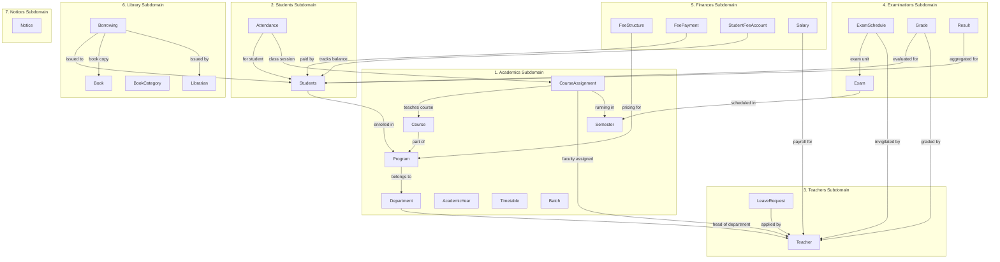
```mermaid
graph TD
    subgraph AcademicsContext["1. Academics Subdomain"]
        Department
        Program
        Course
        AcademicYear
        Semester
        CourseAssignment
        Timetable
        Batch
    end

    subgraph StudentsContext["2. Students Subdomain"]
        Students
        Attendance
    end

    subgraph TeachersContext["3. Teachers Subdomain"]
        Teacher
        LeaveRequest
    end

    subgraph ExamsContext["4. Examinations Subdomain"]
        Exam
        ExamSchedule
        Grade
        Result
    end

    subgraph FinancesContext["5. Finances Subdomain"]
        FeeStructure
        FeePayment
        StudentFeeAccount
        Salary
    end

    subgraph LibraryContext["6. Library Subdomain"]
        Librarian
        BookCategory
        Book
        Borrowing
    end

    subgraph NoticesContext["7. Notices Subdomain"]
        Notice
    end

    %% Key Inter-Context Connections
    Department -->|"head of department"| Teacher
    Program -->|"belongs to"| Department
    Course -->|"part of"| Program
    CourseAssignment -->|"teaches course"| Course
    CourseAssignment -->|"faculty assigned"| Teacher
    CourseAssignment -->|"running in"| Semester
    Students -->|"enrolled in"| Program
    Attendance -->|"for student"| Students
    Attendance -->|"class session"| CourseAssignment
    LeaveRequest -->|"applied by"| Teacher
    Exam -->|"scheduled in"| Semester
    ExamSchedule -->|"exam unit"| Exam
    ExamSchedule -->|"invigilated by"| Teacher
    Grade -->|"evaluated for"| Students
    Grade -->|"graded by"| Teacher
    Result -->|"aggregated for"| Students
    FeeStructure -->|"pricing for"| Program
    FeePayment -->|"paid by"| Students
    StudentFeeAccount -->|"tracks balance"| Students
    Salary -->|"payroll for"| Teacher
    Borrowing -->|"issued to"| Students
    Borrowing -->|"book copy"| Book
    Borrowing -->|"issued by"| Librarian
```

---

## 2. Modular Subdomain ERDs (Zero Line-Crossing)

To completely eliminate line crossing, import these focused per-domain ERDs into draw.io:

### 2.1 Academics & Course Assignment ERD
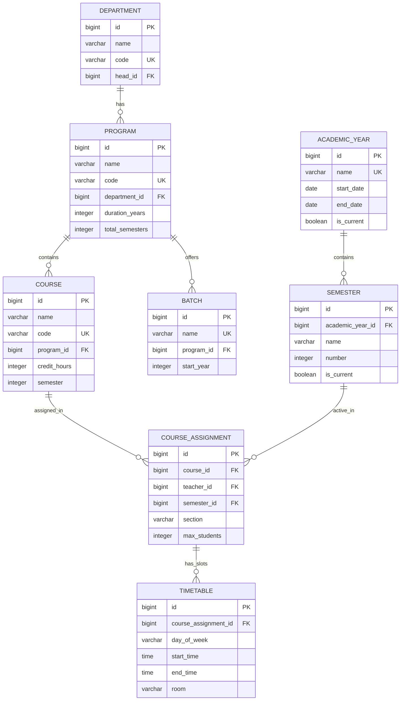
```mermaid
erDiagram
    DEPARTMENT ||--o{ PROGRAM : "has"
    PROGRAM ||--o{ COURSE : "contains"
    PROGRAM ||--o{ BATCH : "offers"
    ACADEMIC_YEAR ||--o{ SEMESTER : "contains"
    COURSE ||--o{ COURSE_ASSIGNMENT : "assigned_in"
    SEMESTER ||--o{ COURSE_ASSIGNMENT : "active_in"
    COURSE_ASSIGNMENT ||--o{ TIMETABLE : "has_slots"

    DEPARTMENT {
        bigint id PK
        varchar name
        varchar code UK
        bigint head_id FK
    }
    PROGRAM {
        bigint id PK
        varchar name
        varchar code UK
        bigint department_id FK
        integer duration_years
        integer total_semesters
    }
    COURSE {
        bigint id PK
        varchar name
        varchar code UK
        bigint program_id FK
        integer credit_hours
        integer semester
    }
    ACADEMIC_YEAR {
        bigint id PK
        varchar name UK
        date start_date
        date end_date
        boolean is_current
    }
    SEMESTER {
        bigint id PK
        bigint academic_year_id FK
        varchar name
        integer number
        boolean is_current
    }
    COURSE_ASSIGNMENT {
        bigint id PK
        bigint course_id FK
        bigint teacher_id FK
        bigint semester_id FK
        varchar section
        integer max_students
    }
    TIMETABLE {
        bigint id PK
        bigint course_assignment_id FK
        varchar day_of_week
        time start_time
        time end_time
        varchar room
    }
    BATCH {
        bigint id PK
        varchar name UK
        bigint program_id FK
        integer start_year
    }
```

### 2.2 Students & Attendance ERD
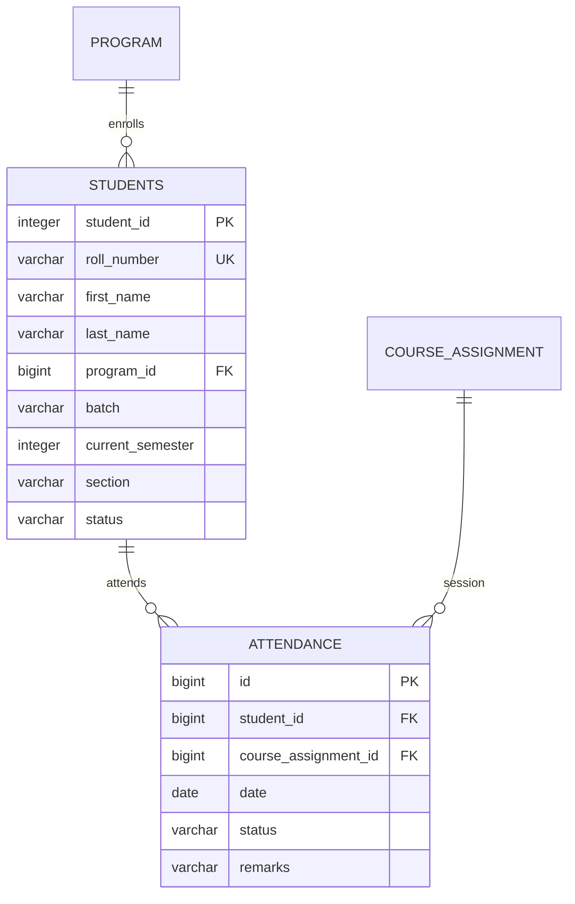
```mermaid
erDiagram
    PROGRAM ||--o{ STUDENTS : "enrolls"
    STUDENTS ||--o{ ATTENDANCE : "attends"
    COURSE_ASSIGNMENT ||--o{ ATTENDANCE : "session"

    STUDENTS {
        integer student_id PK
        varchar roll_number UK
        varchar first_name
        varchar last_name
        bigint program_id FK
        varchar batch
        integer current_semester
        varchar section
        varchar status
    }
    ATTENDANCE {
        bigint id PK
        bigint student_id FK
        bigint course_assignment_id FK
        date date
        varchar status
        varchar remarks
    }
```

### 2.3 Examinations & Results ERD
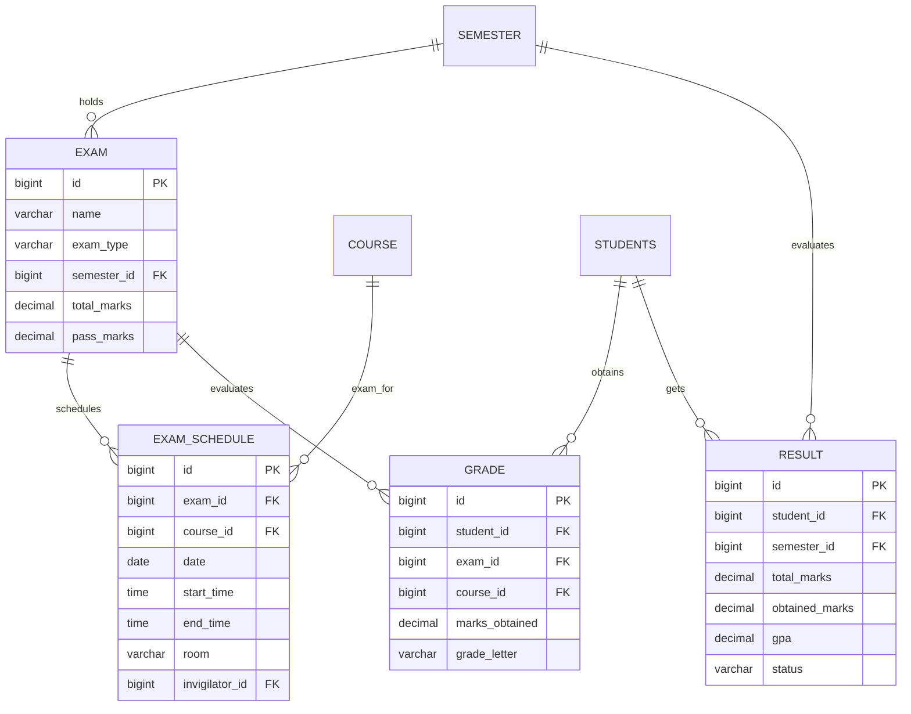
```mermaid
erDiagram
    SEMESTER ||--o{ EXAM : "holds"
    EXAM ||--o{ EXAM_SCHEDULE : "schedules"
    COURSE ||--o{ EXAM_SCHEDULE : "exam_for"
    EXAM ||--o{ GRADE : "evaluates"
    STUDENTS ||--o{ GRADE : "obtains"
    SEMESTER ||--o{ RESULT : "evaluates"
    STUDENTS ||--o{ RESULT : "gets"

    EXAM {
        bigint id PK
        varchar name
        varchar exam_type
        bigint semester_id FK
        decimal total_marks
        decimal pass_marks
    }
    EXAM_SCHEDULE {
        bigint id PK
        bigint exam_id FK
        bigint course_id FK
        date date
        time start_time
        time end_time
        varchar room
        bigint invigilator_id FK
    }
    GRADE {
        bigint id PK
        bigint student_id FK
        bigint exam_id FK
        bigint course_id FK
        decimal marks_obtained
        varchar grade_letter
    }
    RESULT {
        bigint id PK
        bigint student_id FK
        bigint semester_id FK
        decimal total_marks
        decimal obtained_marks
        decimal gpa
        varchar status
    }
```

### 2.4 Finances & Payroll ERD
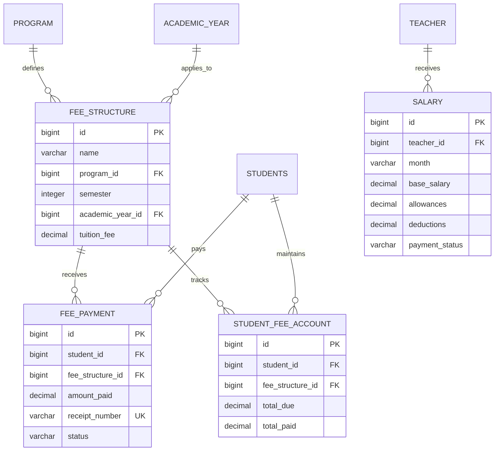
```mermaid
erDiagram
    PROGRAM ||--o{ FEE_STRUCTURE : "defines"
    ACADEMIC_YEAR ||--o{ FEE_STRUCTURE : "applies_to"
    FEE_STRUCTURE ||--o{ FEE_PAYMENT : "receives"
    STUDENTS ||--o{ FEE_PAYMENT : "pays"
    FEE_STRUCTURE ||--o{ STUDENT_FEE_ACCOUNT : "tracks"
    STUDENTS ||--o{ STUDENT_FEE_ACCOUNT : "maintains"
    TEACHER ||--o{ SALARY : "receives"

    FEE_STRUCTURE {
        bigint id PK
        varchar name
        bigint program_id FK
        integer semester
        bigint academic_year_id FK
        decimal tuition_fee
    }
    FEE_PAYMENT {
        bigint id PK
        bigint student_id FK
        bigint fee_structure_id FK
        decimal amount_paid
        varchar receipt_number UK
        varchar status
    }
    STUDENT_FEE_ACCOUNT {
        bigint id PK
        bigint student_id FK
        bigint fee_structure_id FK
        decimal total_due
        decimal total_paid
    }
    SALARY {
        bigint id PK
        bigint teacher_id FK
        varchar month
        decimal base_salary
        decimal allowances
        decimal deductions
        varchar payment_status
    }
```

### 2.5 Library System ERD
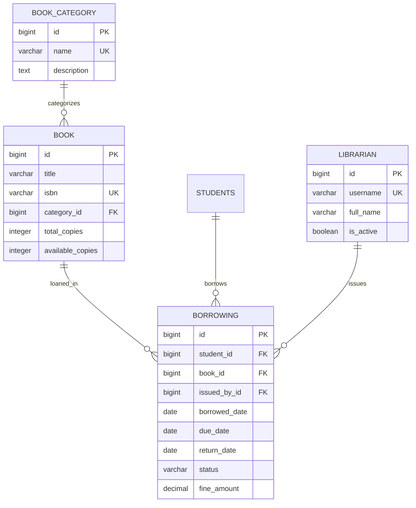
```mermaid
erDiagram
    BOOK_CATEGORY ||--o{ BOOK : "categorizes"
    BOOK ||--o{ BORROWING : "loaned_in"
    STUDENTS ||--o{ BORROWING : "borrows"
    LIBRARIAN ||--o{ BORROWING : "issues"

    LIBRARIAN {
        bigint id PK
        varchar username UK
        varchar full_name
        boolean is_active
    }
    BOOK_CATEGORY {
        bigint id PK
        varchar name UK
        text description
    }
    BOOK {
        bigint id PK
        varchar title
        varchar isbn UK
        bigint category_id FK
        integer total_copies
        integer available_copies
    }
    BORROWING {
        bigint id PK
        bigint student_id FK
        bigint book_id FK
        bigint issued_by_id FK
        date borrowed_date
        date due_date
        date return_date
        varchar status
        decimal fine_amount
    }
```

---

## 3. Modular Subdomain Class Diagrams (Zero Line-Crossing)

Import these per-subdomain UML class diagrams into draw.io to keep class relationships clean and easy to read.

### 3.1 Academics Subdomain Class Diagram
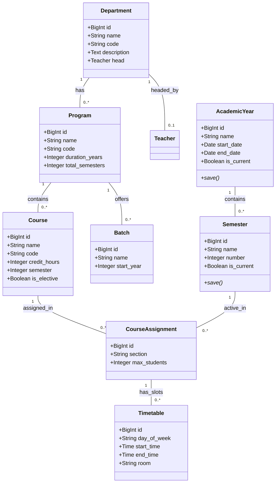
```mermaid
classDiagram
    direction TB
    Department "1" -- "0..*" Program : has
    Department "1" -- "0..1" Teacher : headed_by
    Program "1" -- "0..*" Course : contains
    Program "1" -- "0..*" Batch : offers
    AcademicYear "1" -- "0..*" Semester : contains
    Course "1" -- "0..*" CourseAssignment : assigned_in
    Semester "1" -- "0..*" CourseAssignment : active_in
    CourseAssignment "1" -- "0..*" Timetable : has_slots

    class Department {
        +BigInt id
        +String name
        +String code
        +Text description
        +Teacher head
    }
    class Program {
        +BigInt id
        +String name
        +String code
        +Integer duration_years
        +Integer total_semesters
    }
    class Course {
        +BigInt id
        +String name
        +String code
        +Integer credit_hours
        +Integer semester
        +Boolean is_elective
    }
    class AcademicYear {
        +BigInt id
        +String name
        +Date start_date
        +Date end_date
        +Boolean is_current
        +save()*
    }
    class Semester {
        +BigInt id
        +String name
        +Integer number
        +Boolean is_current
        +save()*
    }
    class CourseAssignment {
        +BigInt id
        +String section
        +Integer max_students
    }
    class Timetable {
        +BigInt id
        +String day_of_week
        +Time start_time
        +Time end_time
        +String room
    }
    class Batch {
        +BigInt id
        +String name
        +Integer start_year
    }
```

### 3.2 Students & Attendance Class Diagram
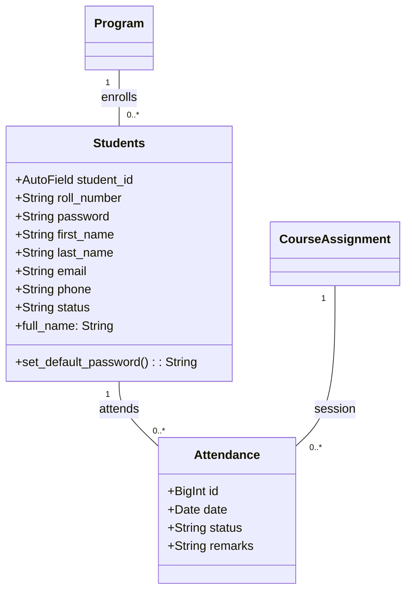
```mermaid
classDiagram
    direction TB
    Program "1" -- "0..*" Students : enrolls
    Students "1" -- "0..*" Attendance : attends
    CourseAssignment "1" -- "0..*" Attendance : session

    class Students {
        +AutoField student_id
        +String roll_number
        +String password
        +String first_name
        +String last_name
        +String email
        +String phone
        +String status
        +full_name: String
        +set_default_password(): String
    }
    class Attendance {
        +BigInt id
        +Date date
        +String status
        +String remarks
    }
```

### 3.3 Teachers & Faculty Class Diagram
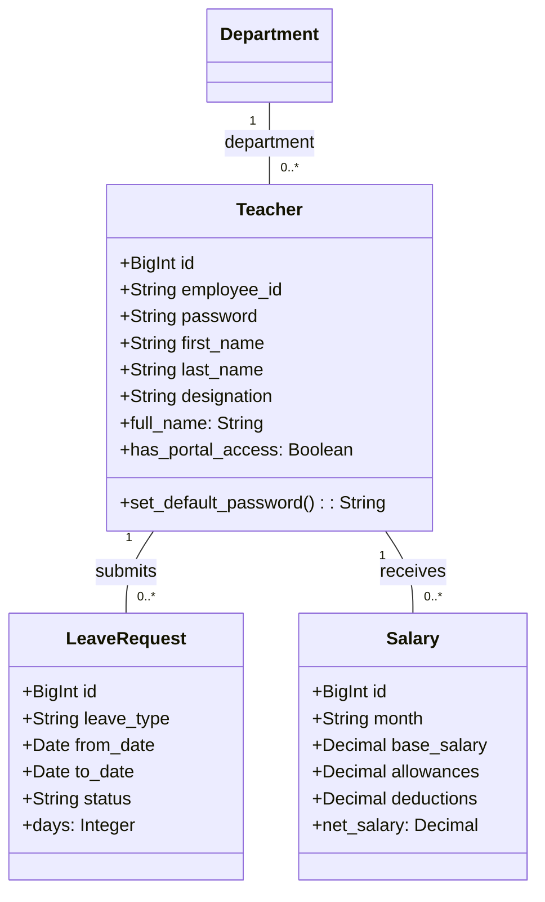
```mermaid
classDiagram
    direction TB
    Department "1" -- "0..*" Teacher : department
    Teacher "1" -- "0..*" LeaveRequest : submits
    Teacher "1" -- "0..*" Salary : receives

    class Teacher {
        +BigInt id
        +String employee_id
        +String password
        +String first_name
        +String last_name
        +String designation
        +full_name: String
        +has_portal_access: Boolean
        +set_default_password(): String
    }
    class LeaveRequest {
        +BigInt id
        +String leave_type
        +Date from_date
        +Date to_date
        +String status
        +days: Integer
    }
    class Salary {
        +BigInt id
        +String month
        +Decimal base_salary
        +Decimal allowances
        +Decimal deductions
        +net_salary: Decimal
    }
```

### 3.4 Examinations & Results Class Diagram
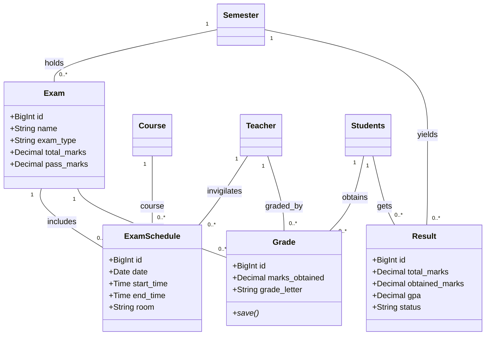
```mermaid
classDiagram
    direction TB
    Semester "1" -- "0..*" Exam : holds
    Exam "1" -- "0..*" ExamSchedule : includes
    Course "1" -- "0..*" ExamSchedule : course
    Teacher "1" -- "0..*" ExamSchedule : invigilates
    Exam "1" -- "0..*" Grade : evaluates
    Students "1" -- "0..*" Grade : obtains
    Teacher "1" -- "0..*" Grade : graded_by
    Semester "1" -- "0..*" Result : yields
    Students "1" -- "0..*" Result : gets

    class Exam {
        +BigInt id
        +String name
        +String exam_type
        +Decimal total_marks
        +Decimal pass_marks
    }
    class ExamSchedule {
        +BigInt id
        +Date date
        +Time start_time
        +Time end_time
        +String room
    }
    class Grade {
        +BigInt id
        +Decimal marks_obtained
        +String grade_letter
        +save()*
    }
    class Result {
        +BigInt id
        +Decimal total_marks
        +Decimal obtained_marks
        +Decimal gpa
        +String status
    }
```

### 3.5 Finances & Payroll Class Diagram
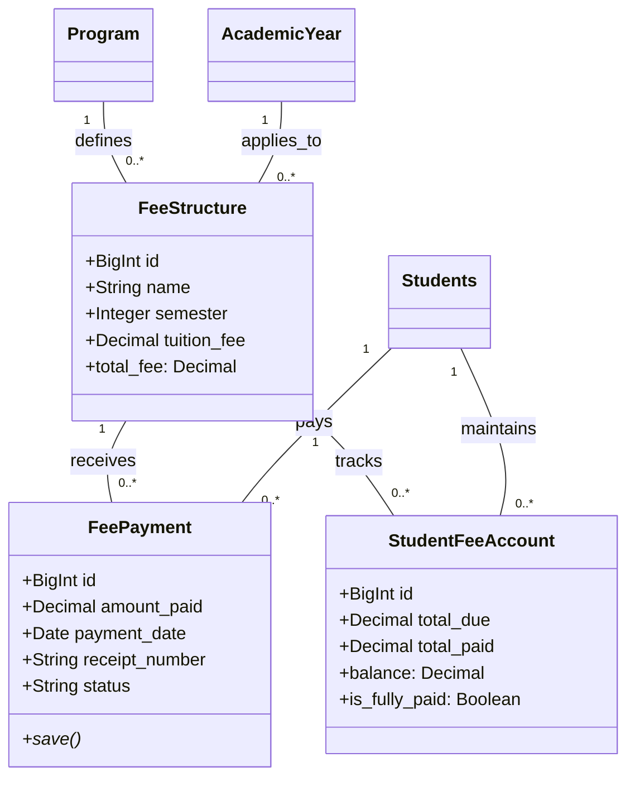
```mermaid
classDiagram
    direction TB
    Program "1" -- "0..*" FeeStructure : defines
    AcademicYear "1" -- "0..*" FeeStructure : applies_to
    FeeStructure "1" -- "0..*" FeePayment : receives
    Students "1" -- "0..*" FeePayment : pays
    FeeStructure "1" -- "0..*" StudentFeeAccount : tracks
    Students "1" -- "0..*" StudentFeeAccount : maintains

    class FeeStructure {
        +BigInt id
        +String name
        +Integer semester
        +Decimal tuition_fee
        +total_fee: Decimal
    }
    class FeePayment {
        +BigInt id
        +Decimal amount_paid
        +Date payment_date
        +String receipt_number
        +String status
        +save()*
    }
    class StudentFeeAccount {
        +BigInt id
        +Decimal total_due
        +Decimal total_paid
        +balance: Decimal
        +is_fully_paid: Boolean
    }
```

### 3.6 Library System Class Diagram
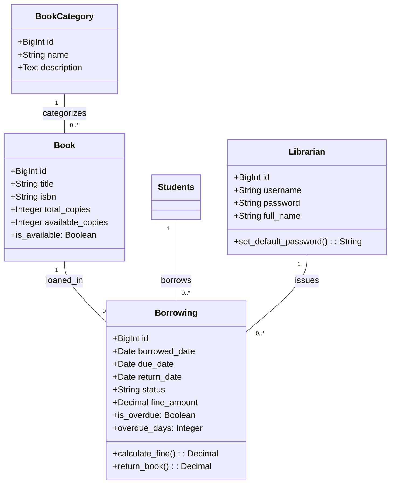
```mermaid
classDiagram
    direction TB
    BookCategory "1" -- "0..*" Book : categorizes
    Book "1" -- "0..*" Borrowing : loaned_in
    Students "1" -- "0..*" Borrowing : borrows
    Librarian "1" -- "0..*" Borrowing : issues

    class Librarian {
        +BigInt id
        +String username
        +String password
        +String full_name
        +set_default_password(): String
    }
    class BookCategory {
        +BigInt id
        +String name
        +Text description
    }
    class Book {
        +BigInt id
        +String title
        +String isbn
        +Integer total_copies
        +Integer available_copies
        +is_available: Boolean
    }
    class Borrowing {
        +BigInt id
        +Date borrowed_date
        +Date due_date
        +Date return_date
        +String status
        +Decimal fine_amount
        +is_overdue: Boolean
        +overdue_days: Integer
        +calculate_fine(): Decimal
        +return_book(): Decimal
    }
```

---

## 4. Sequence Interaction Diagrams

### 4.1 Fee Payment & Receipt Generation Sequence
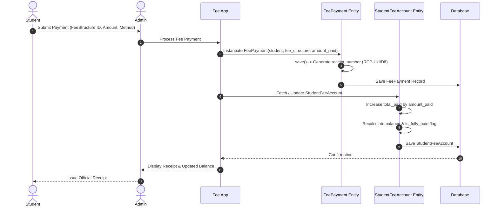
```mermaid
sequenceDiagram
    autonumber
    actor Student
    actor Admin
    participant System as Fee App
    participant Payment as FeePayment Entity
    participant Account as StudentFeeAccount Entity
    participant DB as Database

    Student->>Admin: Submit Payment (FeeStructure ID, Amount, Method)
    Admin->>System: Process Fee Payment
    System->>Payment: Instantiate FeePayment(student, fee_structure, amount_paid)
    Payment->>Payment: save() -> Generate receipt_number (RCP-UUID8)
    Payment->>DB: Save FeePayment Record
    System->>Account: Fetch / Update StudentFeeAccount
    Account->>Account: Increase total_paid by amount_paid
    Account->>Account: Recalculate balance & is_fully_paid flag
    Account->>DB: Save StudentFeeAccount
    DB-->>System: Confirmation
    System-->>Admin: Display Receipt & Updated Balance
    Admin-->>Student: Issue Official Receipt
```

### 4.2 Library Book Borrowing & Return Sequence
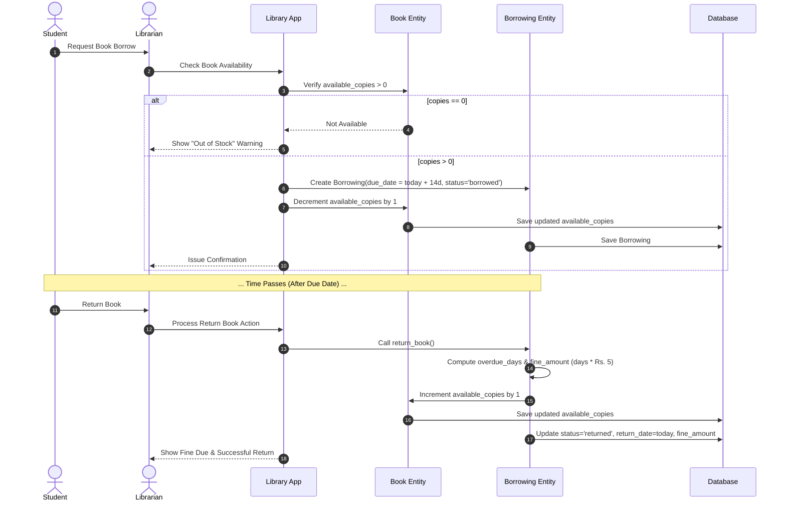
```mermaid
sequenceDiagram
    autonumber
    actor Student
    actor Librarian
    participant Library as Library App
    participant Book as Book Entity
    participant Borrowing as Borrowing Entity
    participant DB as Database

    Student->>Librarian: Request Book Borrow
    Librarian->>Library: Check Book Availability
    Library->>Book: Verify available_copies > 0
    alt copies == 0
        Book-->>Library: Not Available
        Library-->>Librarian: Show "Out of Stock" Warning
    else copies > 0
        Library->>Borrowing: Create Borrowing(due_date = today + 14d, status='borrowed')
        Library->>Book: Decrement available_copies by 1
        Book->>DB: Save updated available_copies
        Borrowing->>DB: Save Borrowing
        Library-->>Librarian: Issue Confirmation
    end

    note over Student, Borrowing: ... Time Passes (After Due Date) ...

    Student->>Librarian: Return Book
    Librarian->>Library: Process Return Book Action
    Library->>Borrowing: Call return_book()
    Borrowing->>Borrowing: Compute overdue_days & fine_amount (days * Rs. 5)
    Borrowing->>Book: Increment available_copies by 1
    Book->>DB: Save updated available_copies
    Borrowing->>DB: Update status='returned', return_date=today, fine_amount
    Library-->>Librarian: Show Fine Due & Successful Return
```

---

## 5. Entity State Machine Diagrams

### 5.1 LeaveRequest State Machine
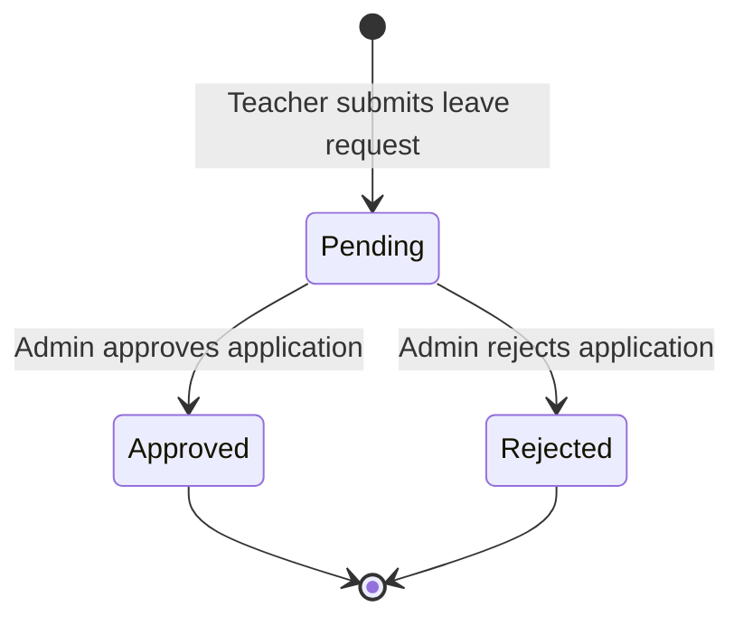
```mermaid
stateDiagram-v2
    [*] --> Pending : Teacher submits leave request
    Pending --> Approved : Admin approves application
    Pending --> Rejected : Admin rejects application
    Approved --> [*]
    Rejected --> [*]
```

### 5.2 Borrowing Lifecycle State Machine
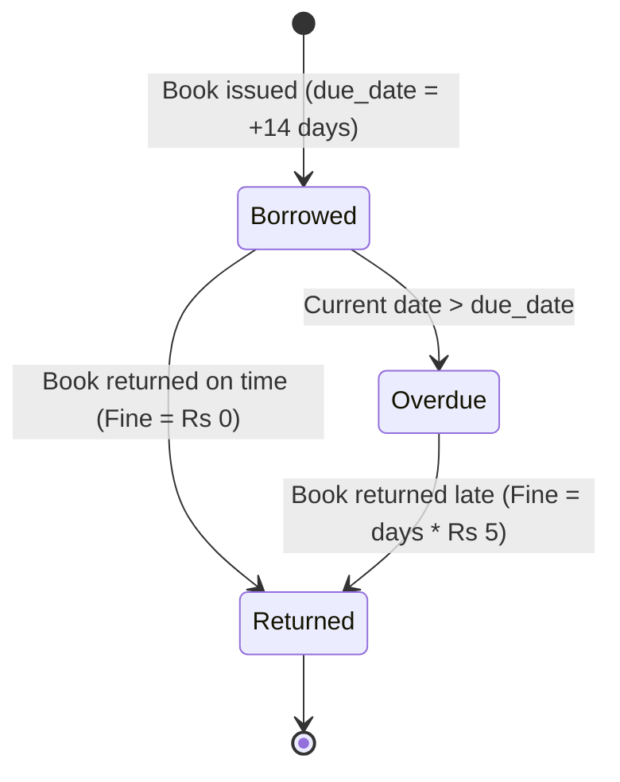
```mermaid
stateDiagram-v2
    [*] --> Borrowed : Book issued (due_date = +14 days)
    Borrowed --> Overdue : Current date > due_date
    Borrowed --> Returned : Book returned on time (Fine = Rs 0)
    Overdue --> Returned : Book returned late (Fine = days * Rs 5)
    Returned --> [*]
```

### 5.3 Fee Account Payment State Machine
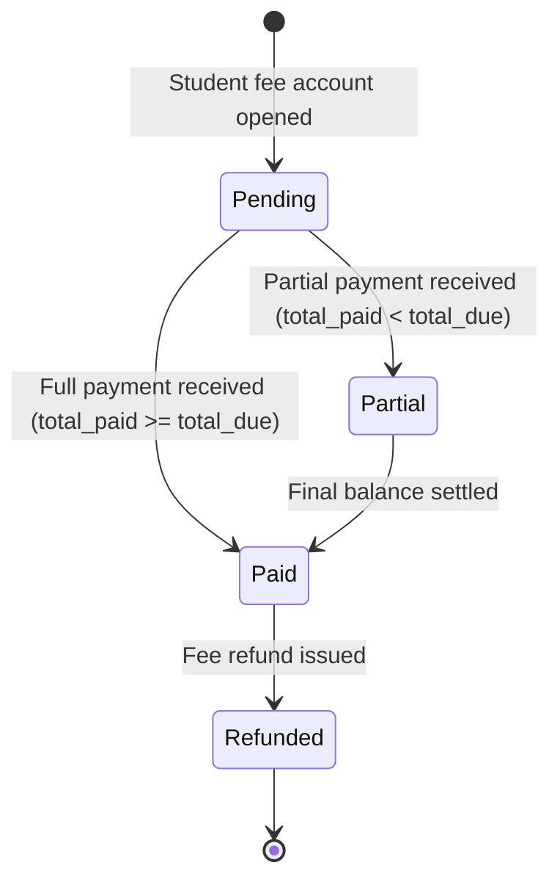
```mermaid
stateDiagram-v2
    [*] --> Pending : Student fee account opened
    Pending --> Partial : Partial payment received (total_paid < total_due)
    Pending --> Paid : Full payment received (total_paid >= total_due)
    Partial --> Paid : Final balance settled
    Paid --> Refunded : Fee refund issued
    Refunded --> [*]
```
